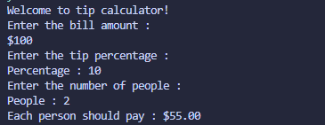

# Tip Calculator

## Concepts Learned / Used
- Variables
- User Input (`input`)
- Type Conversion (`int`, `float`)
- Arithmetic Operations
- String Formatting
- `format()` Function
- f-Strings

## New Learning

```python
"{:.2f}".format(value)
```

The `format()` function is used to control how a value is displayed.

### Breakdown
- `:` → starts formatting instructions
- `.2` → keeps 2 digits after the decimal
- `f` → formats the value as a floating point (decimal) number

## Output


## Summary

This program calculates how much each person should pay after adding a tip to the total bill and splitting it equally among multiple people.