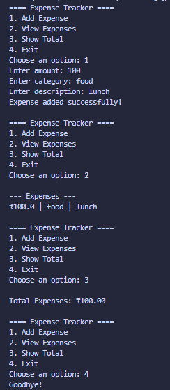

# Expense Tracker

## Concepts Learned / Used

* Variables
* Functions
* User Input (`input`)
* Conditional Statements (`if`, `elif`, `else`)
* Loops (`while`)
* File Handling
* CSV Module (`csv`)
* OS Module (`os.path.exists`)
* Lists
* Type Conversion (`float`)
* String Formatting (f-strings)

## New Learning

```python
import csv

with open("expenses.csv", "a", newline="") as file:
    writer = csv.writer(file)
    writer.writerow([amount, category, description])
```

The `csv.writer()` function is used to write data into a CSV (Comma-Separated Values) file.

### Breakdown

* `csv` → Python module for reading and writing CSV files
* `open(..., "a")` → Opens the file in append mode
* `csv.writer()` → Creates a writer object
* `writer.writerow()` → Adds a new row of data to the file

### Another New Concept

```python
if not os.path.exists(FILENAME):
```

The `os.path.exists()` function checks whether a file already exists before creating it.

### Breakdown

* `os` → Module for interacting with the operating system
* `path.exists()` → Returns `True` if the file exists
* `not` → Reverses the result

## Output



## Summary

This program creates a simple Expense Tracker that allows users to record daily expenses, view all saved expenses, and calculate total spending. The expense data is stored in a CSV file, making it available even after the program is closed. This project helped practice file handling, data storage, loops, functions, and working with Python modules.
