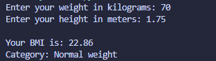

# BMI Calculator

## Concepts Learned / Used
- Variables
- User Input (`input`)
- Type Conversion (`float`)
- Arithmetic Operations
- Conditional Statements (`if`, `elif`, `else`)
- f-Strings

This formula calculates BMI using weight and height.

## Output

## Summary

This program takes height and weight as input, calculates BMI, and displays the BMI category.