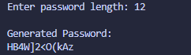

# Random Password Generator

## Concepts Learned / Used
- Variables
- User Input (`input`)
- Type Conversion (`int`)
- Python Modules
- `random` Module
- `string` Module
- String Concatenation
- `for` Loops
- `random.choice()`

## New Learning

```python
random.choice(sequence)
```

The `random.choice()` function is used to select a random item from a sequence like a string, list, or tuple.

### Example

```python
import random

letters = "abcde"

print(random.choice(letters))
```

### Possible Output

```text
c
```

---

## Using the `string` Module

```python
string.ascii_letters
string.digits
string.punctuation
```

These built-in constants help generate random characters easily.

### Breakdown

| Constant | Purpose |
|----------|----------|
| `ascii_letters` | All uppercase and lowercase letters |
| `digits` | Numbers from 0–9 |
| `punctuation` | Special symbols |

---

## How the Program Works

1. The user enters the password length.
2. The program combines:
   - Letters
   - Numbers
   - Symbols
3. A loop runs based on the given length.
4. `random.choice()` picks random characters one by one.
5. The final password is displayed.

---

## Output



---

## Summary

This program generates a random password using letters, numbers, and special symbols.

It also introduces:
- Python modules
- Random value generation
- String handling
- Loops
- User input

This is a great beginner project for understanding how real-world password generators work.