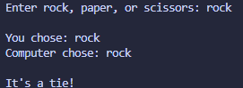

# Rock Paper Scissors

## Concepts Learned / Used

* Variables
* User Input (`input`)
* Conditional Statements (`if`, `elif`, `else`)
* Lists
* Random Module (`random.choice`)
* Logical Operators (`and`, `or`)
* String Methods (`lower()`)
* Comparison Operators

## New Learning

```python
import random

computer = random.choice(choices)
```

The `random.choice()` function is used to select a random item from a list.

### Breakdown

* `random` → Python module for generating random values
* `choice()` → selects one random element
* `choices` → list containing possible game options

## Output



## Summary

This program creates a simple Rock Paper Scissors game where the user plays against the computer. The computer randomly selects a choice, and the program determines the winner based on the game rules.
