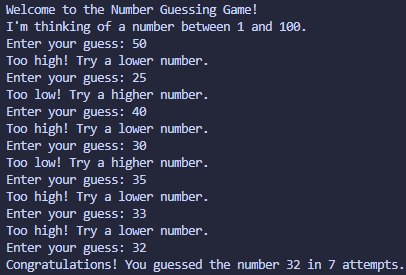

# Number Guessing Game

## Concepts Learned / Used
- Variables
- User Input (`input`)
- Type Conversion (`int`)
- Random Number Generation (`random`)
- Conditional Statements (`if`, `elif`, `else`)
- Loops (`while`)
- Exception Handling (`try`, `except`)
- Comparison Operators (`<`, `>`, `==`)
- String Formatting (f-Strings)

## New Learning

```python
import random

secret_number = random.randint(1, 100)
```

The `random.randint()` function generates a random integer within a specified range.

### Breakdown
- `random` → Python module for generating random values
- `randint()` → Returns a random integer
- `1` → Lower limit (inclusive)
- `100` → Upper limit (inclusive)

### Example

```python
import random

print(random.randint(1, 10))
```

Output:

```text
7
```

(The number will be different each time.)

## Output



## Summary

This program generates a random number between 1 and 100 and asks the user to guess it. The program provides hints indicating whether the guess is too high or too low and continues until the correct number is guessed. It also keeps track of the number of attempts made by the user.