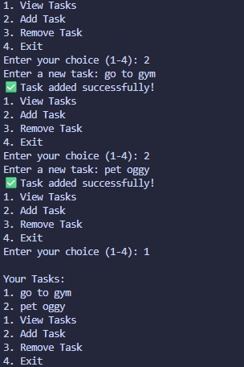

# To-Do List CLI

## Concepts Learned / Used
- Variables
- Lists
- User Input (`input`)
- Loops (`while`)
- Conditional Statements (`if`, `elif`, `else`)
- List Methods (`append`, `pop`)
- String Formatting (f-Strings)
- Menu-Driven Programs

## New Learning

```python
tasks.append(task)
```

The `append()` method is used to add a new item to the end of a list.

### Breakdown
- `tasks` → The list storing all tasks
- `append()` → Adds an item to the list
- `task` → The new task entered by the user

### Example

```python
tasks = []

tasks.append("Complete Python project")
tasks.append("Read a book")

print(tasks)
```

Output:

```text
['Complete Python project', 'Read a book']
```

## Output



## Summary

This program is a command-line To-Do List application that allows users to manage their tasks. Users can add new tasks, view all existing tasks, and remove completed tasks. The application runs continuously using a menu-driven interface until the user chooses to exit, providing a simple way to organize daily activities.