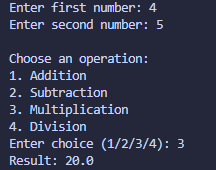

# Simple Calculator

## Concepts Learned / Used

* Functions (`def`)
* Function Parameters and Return Values
* User Input (`input`)
* Type Conversion (`float`)
* Conditional Statements (`if`, `elif`, `else`)
* Arithmetic Operators (`+`, `-`, `*`, `/`)
* Error Handling for Division by Zero
* Menu-Driven Programs

## New Learning

```python
def add(a, b):
    return a + b
```

Functions are reusable blocks of code that perform a specific task. They help organize code and avoid repetition.

## Output



## Summary

This program is a command-line Simple Calculator that performs basic arithmetic operations such as addition, subtraction, multiplication, and division. The calculator uses separate functions for each operation, making the code modular and reusable. Users enter two numbers, select an operation from a menu, and the program displays the result. It also handles division-by-zero errors to prevent crashes and improve reliability.
