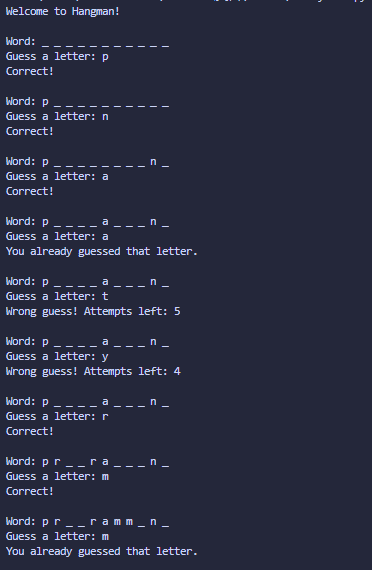

# Hangman Game

## Concepts Learned / Used

* Python Modules (`random`)
* Lists
* Loops (`while`, `for`)
* Conditional Statements (`if`, `elif`, `else`)
* User Input (`input`)
* String Manipulation
* Membership Operators (`in`, `not in`)
* List Operations (`append`)
* Input Validation
* Game Logic Implementation

## Output

## Summary

This program is a command-line Hangman Game where the player attempts to guess a hidden word one letter at a time. A random word is selected from a predefined list, and the player has a limited number of attempts to guess incorrect letters. The game displays correctly guessed letters while hiding the remaining ones with underscores. Input validation prevents invalid or repeated guesses, and the game ends when the player successfully guesses the word or runs out of attempts. This project demonstrates the use of loops, conditionals, lists, string handling, and basic game development concepts in Python.
