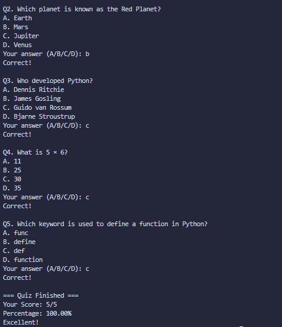

# Quiz App

## Concepts Learned / Used

* Lists
* Dictionaries
* Loops (`for`)
* Conditional Statements (`if`, `elif`, `else`)
* User Input (`input`)
* String Methods (`strip()`, `upper()`)
* Score Tracking
* Percentage Calculation
* Multiple Choice Questions (MCQ)
* Data Storage Using Dictionaries
* Quiz/Game Logic Implementation

## Output

## Summary

This program is a command-line Quiz App where the player answers multiple-choice questions by selecting the correct option. The questions, options, and answers are stored using dictionaries inside a list. The program displays each question, accepts user input, validates the answer, and updates the score accordingly. At the end of the quiz, the total score and percentage are calculated and displayed along with a performance message. This project demonstrates the use of lists, dictionaries, loops, conditionals, user input handling, string manipulation, and basic game development concepts in Python.